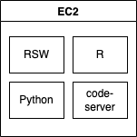
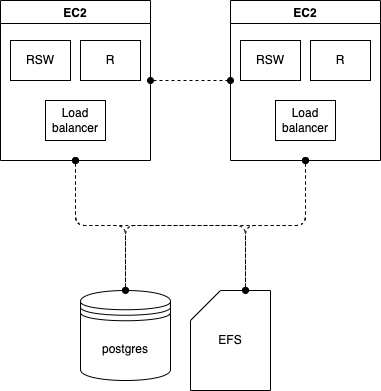

# pulumi-recipes

Recipes for deploying RStudio Products with Pulumi.

## Pulumi

### Getting started

All of the recipes require that you have Pulumi set up and running on your computer. If this is your first time using Pulumi we recommend that you follow along with the Pulumi getting started tutorial: <https://www.pulumi.com/docs/get-started/aws/begin/>.

### Install justfile

On mac:

```bash
brew install just
```

*For other operating systems see <https://github.com/casey/just#packages>.

### Install Pulumi

Install Pulumi:

```bash
brew install pulumi/tap/pulumi
```

### Configure Pulumi to access your AWS Account

#### Option 1

If you are using AWS SSO make sure you are logged in:

```bash
aws sso login
```

#### Option 2

If supported you can use an access key / secret key.

```bash
export AWS_ACCESS_KEY_ID=<YOUR_ACCESS_KEY_ID>
export AWS_SECRET_ACCESS_KEY=<YOUR_SECRET_ACCESS_KEY>
```

## Recipes

| Name                                                                            | Description                                                                 | Architecture                                                    |
| ------------------------------------------------------------------------------- | --------------------------------------------------------------------------- | --------------------------------------------------------------- |
| [rsw-single-server-local-launcher](recipes/rsw-single-server-local-launcher/)   | A single server deployment of RStudio Workbench with code-server installed. |   |
| [rsw-ha](recipes/rsw-ha/)                                                       | A two server high availability RStudio Workbench deployment.                |                             |


