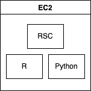
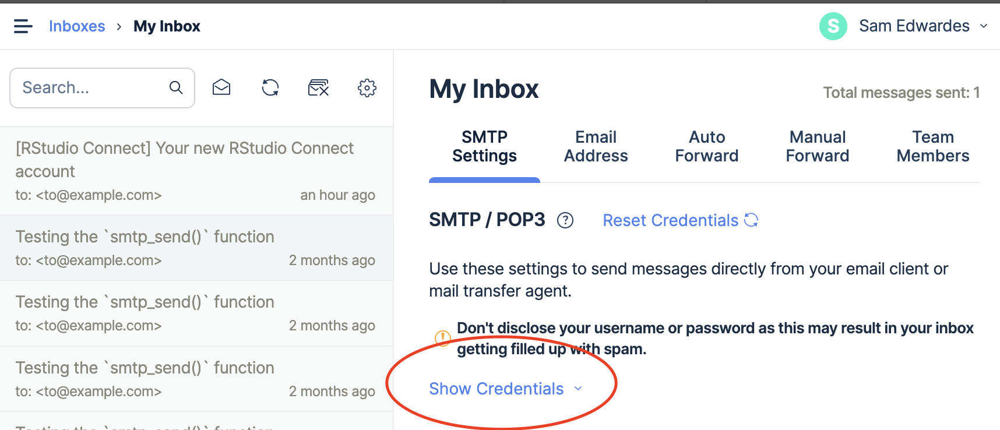

# RStudio Connect Single Server



## Usage

Before getting started please read the project [README](../../README.md) to ensure you have all of the required dependencies installed.

There are three primary files / directories:

- `__main__.py`: contains the python code that will stand up the AWS resources.
- `server-side-files/justfile`: contains the commands required to install RSC and the required dependencies. This file will be copied to each ec2 instance so that it can be executed on the server.
- `server-side-files/config/`: a directory containing all of the configuration files.

### Step 1: Set up mailtrap

This deployment uses <mailtrap.io> to act as a free SMPT server. This is useful for testing and creating a more realistic Connect deployment.

- Sign up for a free [mailtrap.io](https://mailtrap.io/register/signup?ref=header) account.
- Take note of the `Username` and `Password` in **My inbox** > **SMTP Settings** > **Show Credentials**. You will pass these values into you Pulumi config.



> When you create new users for testing you should use the email `to@example.com` for all users. When new users sign up you will then be able to view the confirmation email in your mailtrap inbox.

### Step 2: Log into AWS

```bash
aws sso login
```

### Step 3: Create new virtual environment

```bash
python -m venv venv
source venv/bin/activate
python -m pip install --upgrade pip wheel setuptools
pip install -r requirements.txt
```

### Step 4: Pulumi configuration

Select your pulumi stack.

```bash
pulumi stack select dev
```

Create a new key pair to be used with AWS:

```
just key-pair-new
```

Set the following pulumi configuration values:

```bash
pulumi config set email $MY_EMAIL
pulumi config set --secret rsc_license $RSC_LICENSE
pulumi config set --secret mail_trap_user $MAIL_TRAP_USER
pulumi config set --secret mail_trap_password $MAIL_TRAP_PASSWORD
cat key.pub | pulumi config set public_key
```

### Step 5: Spin up infra

Create all of the infrastructure.

```bash
pulumi up
```

### Step 6: Validate that RSC is working

Visit RSC in your browser:

```
just server-open
```

Login and start some new sessions.

You can also ssh into the ec2 instances for any debugging.

```bash
just server-ssh
```